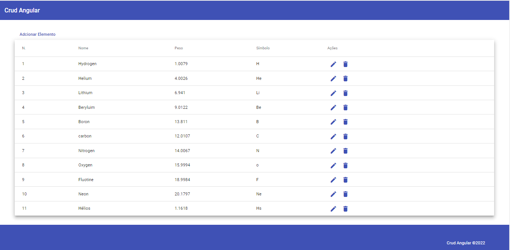
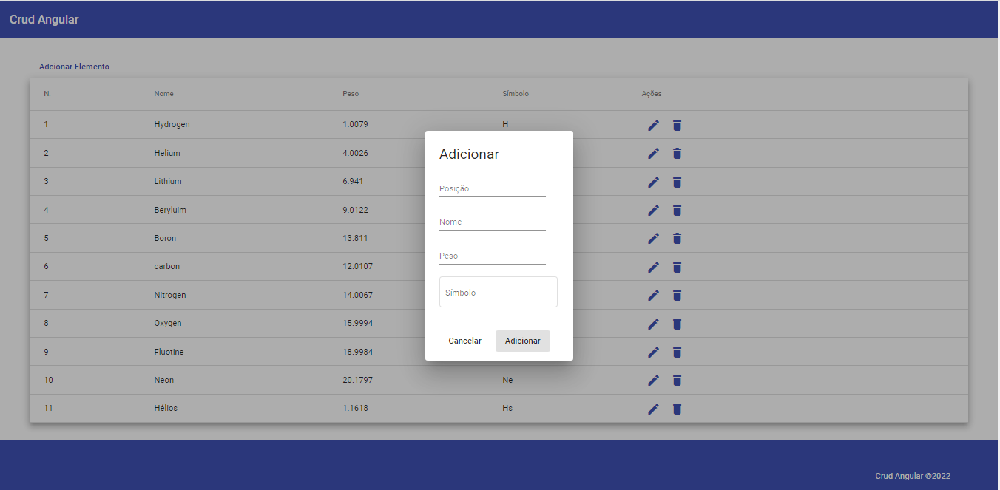
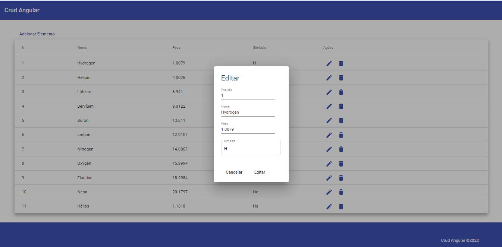

# crud-angular.github.io
Aplicação com as operações básicas CRUD, usando backend json server que simula uma api rest.
O deploy foi realizado no [netlify.](https://www.netlify.com/)

Layout da aplicação:

